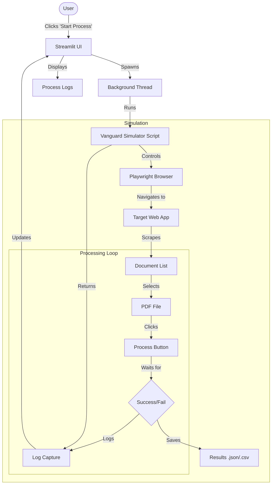

# Cadbury - Vanguard Simulator

This project contains a Streamlit application used to simulate and automate interactions with the Vanguard app using Playwright.

## Structure
- **app.py**: The main Streamlit application.
- **vanguard_simulator.py**: The core simulation logic using Playwright.
- **requirements.txt**: Python dependencies.
- **run.bat**: Batch script to launch the application easily.

## Setup & Installation

1.  **Install Python 3.10+**.
2.  **Install dependencies**:
    ```bash
    pip install -r requirements.txt
    ```
3.  **Install Playwright browsers**:
    ```bash
    playwright install
    ```

## Running the App

Double-click `run.bat` or execute:

```powershell
.\run.bat
```

Or manually:


## Workflow Diagram


